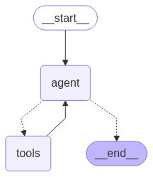

# Multi-Agent Travel Planning Platform

An AI-powered travel planning platform built with LangGraph, LangChain, and tool-augmented agents. The system helps users generate travel plans by coordinating destination discovery, attraction search, route planning, transportation lookup, and nearby restaurant/hotel recommendations.

## Features

- Multi-agent workflow orchestration with LangGraph
- Tool-calling workflow for travel search and itinerary generation
- Destination and attraction recommendation
- Transportation and route planning
- Nearby restaurant and hotel search
- Interactive Gradio web interface
- Conversation state management and planning history support

## Tech Stack

- Python
- LangGraph
- LangChain
- Gradio
- LLM APIs
- Amap API
- DuckDuckGo Search
- Selenium
- BeautifulSoup

## Project Structure

```text
├── agents/           # Agent logic and LLM interaction
├── graph/            # LangGraph workflow and state transitions
├── models/           # LLM factory and model initialization
├── prompts/          # Prompt templates
├── states/           # Conversation and workflow state definitions
├── tools/            # External tools for search, maps, routes, POI, and saving
├── utils/            # Helper functions
├── webrun.py         # Gradio web app entry point
├── req.txt           # Dependency list
├── README.md         # Project documentation
├── travel.png        # LangGraph workflow visualization
├── WorkFlow.png      # System interaction workflow
```

## Installation

1. Install Python 3.10 or above.
2. Install the required dependencies:

   ```bash
   pip install -r req.txt
   ```

## How to Run

Run the Web interface directly:
```bash
python webrun.py
```
After startup, the Gradio web interface will open automatically. Users can directly input their requirements to chat with the bot.

## Workflow Architecture Diagram



## Main Modules and Tools Description

### agents/
- `agents.py`：Defines Agent and AsyncAgent, responsible for interacting with Large Language Models (LLMs) and making decisions.

### graph/
- `graph.py`：Defines the workflow graph for the entire conversation and tasks, describing the transition relationships between nodes (e.g., Agents, tool calls).

### models/
- `factory.py`：Encapsulates the creation logic of LLMs, currently supporting the OpenAI GPT series.

### prompts/
- `main.py`：Stores AI prompt templates to standardize AI behavior and output formats.

### states/
- `state.py`：Defines the data structures for conversation states (such as PublicState), used for passing messages between nodes.

### tools/
- `attractions.py`：Tool for scraping and organizing attraction information.
- `locations.py`：Tool for querying geographical coordinates.
- `nearby.py`：Tool for querying nearby POIs such as dining and accommodations.
- `save.py`：Tool for saving information.
- `static_map.py`： Tool for fetching static map images. 
- `transportation.py`：Tool for transportation route planning. 
- `web_search.py`：Web search tool to assist in completing missing information.

### utils/
- `helper.py`：Common helper functions, such as getting the current time.

### webrun.py
-  Gradio Web interface entry point, integrating conversations, debug information display, etc.

## Main API/Tool Parameters and Return Values Description

### 1. Attraction Information Query (tools/attractions.py)
- **Function**: `get_attractions_information(destination: str) -> dict`
- **Parameters**:
  - `destination`: Destination name (e.g., "Changsha"), must be a specific city or town name.
- **Returns**:
  - `overview`: Destination overview
  - `scenic_list`: List of attractions (including name, introduction, opening hours, etc.)

### 2. Route Planning (tools/transportation.py)
- **Function**: `route_planning(origin: str, destination: str, origin_city_code: str, dest_city_code: str) -> dict`
- **Parameters**:
  - `origin`: Coordinates (latitude and longitude) of the starting point (e.g., "113.129362,29.371356")
  - `destination`: Coordinates of the destination
  - `origin_city_code`: Origin city code
  - `dest_city_code`: Destination city code
- **Returns**:
  - `origin`, `destination`, `walking_distance`, `taxi_cost`, `public_transport_options_list` (list of public transport options)

### 3. Nearby POI Query (tools/nearby.py)
- **Function**: `search_nearby_poi(location: str, city: str, types: str, keyword: str, radius: int, offset: int, page: int)`
- **Parameters**:
  - `location`: Coordinates of the center point
  - `city`: City code
  - `types`: POI types (e.g., "Chinese Restaurant|Hotel")
  - `keyword`: Keyword
  - `radius`: Search radius (meters)
  - `offset`: Number of items per page
  - `page`: Page number
- **Returns**:
  - `pois`: List of POIs (including name, type, address, distance, rating, price, etc.)

### 4. Save Information (tools/save.py)
- **Function**: `save_info_and_clear_history(information_to_save: str) -> Tuple[str, str]`
- **Parameters**:
  - `information_to_save`: Information to be saved
- **Returns**:
  - `content`: Save result prompt
  - `artifact`: Actually saved information

## FAQ and Improvement Suggestions
- If you encounter issues like invalid API KEYs or network connection problems, please check the `.env` configuration and network environment.
- If you need to support more cities or attractions, you can expand the related tool modules.
- Suggestions and feedback are welcome to help us continuously improve the bot's features!

---
